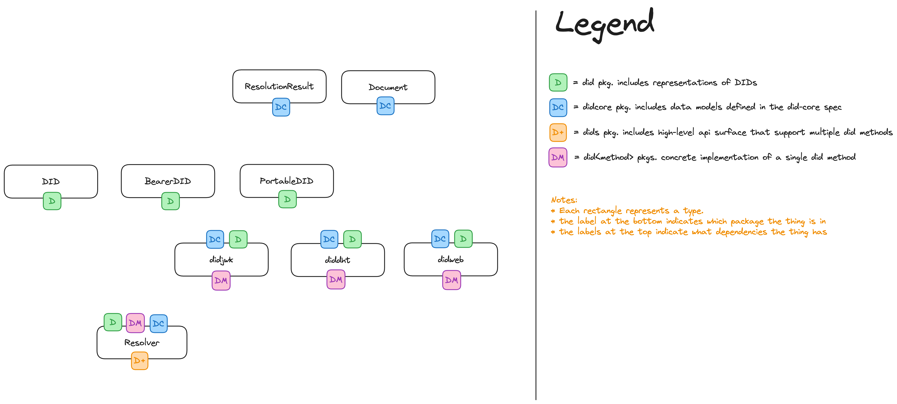

# dids <!-- omit in toc -->


# Table of Contents <!-- omit in toc -->

- [Features](#features)
- [Usage](#usage)
  - [DID Creation](#did-creation)
    - [`did:jwk`](#didjwk)
    - [`did:dht`](#diddht)
    - [`did:web`](#didweb)
  - [DID Resolution](#did-resolution)
  - [Importing / Exporting](#importing--exporting)
    - [Exporting](#exporting)
    - [Importing](#importing)
- [Development](#development)
  - [Directory Structure](#directory-structure)
    - [Rationale](#rationale)
  - [Adding a new DID Method](#adding-a-new-did-method)
    - [Creation](#creation)
    - [Resolution](#resolution)


# Features

* `did:jwk` creation and resolution
* `did:dht` creation and resoluton
* DID Parsing
* `BearerDID` concept.
* `BearerDID` import and export
* All did core spec data structures
* singleton DID resolver

> [!NOTE]
> This package uses the term `DID` to refer to the string representation e.g. `did:ex:1234` and `BearerDID` to refer to is a composite type that combines a DID with a KeyManager containing keys associated to the DID. Together, these two components form a BearerDID that can be used to
sign data.

> [!NOTE]
> wtf is a _Bearer_ DID? `BearerDID` is a term i came up with in a state of delirium in order to distinguish between a DID (aka `did:ex:moegrammer` aka a string) and a DID + a key manager containing private keys associated to the DID. _Bearer_ because..
>
>  The term "bearer" in the context of identity and access management originates from the concept of "bearer instruments" in financial services. In finance, a bearer instrument is a document that entitles the holder or "bearer" to the rights or assets it represents. The key characteristic of a bearer instrument is that it grants ownership or rights to whoever physically holds it, without necessarily identifying that person.
>
> Applying this concept to the digital realm, particularly in security and authentication, a bearer token functions similarly.
>
> In summary, the term "bearer" in identity and access management is borrowed from the financial concept of bearer instruments, emphasizing the importance of possession in determining access rights or ownership. This parallel underscores the need for careful security measures in the management of bearer tokens in digital systems.

# Usage

## DID Creation


### `did:jwk`
```go
package main

import (
    "fmt"
    "github.com/tbd54566975/web5-go/didjwk"
)

func main() {
    // Create a new DID
    bearerDID, err := didjwk.Create()
    if err != nil {
        fmt.Printf("Failed to create new DID: %v\n", err)
        return
    }

    fmt.Printf("New DID created: %s\n", bearerDID.URI)
}
```

> [!NOTE]
> if no arguments are provided, uses `LocalKeyManager` by default and uses `Ed25519` to generate key


Providing a custom key manager can be done like so:

```go
package main

import (
    "fmt"
    "github.com/tbd54566975/web5-go/didjwk"
)

func main() {
    km, err := AWSKeyManager()
    if err != nil {
        fmt.Errorf("failed to initialize AWS Key Manager. %w", err)
    }
    
    bearerDID, err := didjwk.Create(KeyManager(km))
    if err != nil {
        fmt.Printf("Failed to create new DID: %v\n", err)
        return
    }

    fmt.Printf("New DID created: %s\n", bearerDID.URI)
}
```

> [!WARNING]
> `AWSKeyManager` doesn't exist yet in `web5-go` but will soon

Overriding the default Alogithm ID can be done like so:

```go
package main

import (
    "fmt"
    "github.com/tbd54566975/web5-go/dsa"
    "github.com/tbd54566975/web5-go/didjwk"
)

func main() {
    bearerDID, err := didjwk.Create(AlgorithmID(dsa.AlgorithmIDED25519))
    if err != nil {
        fmt.Printf("Failed to create new DID: %v\n", err)
        return
    }

    fmt.Printf("New DID created: %s\n", bearerDID.URI)
}
```

> [!IMPORTANT]
> Options can be passed in any order and are _not_ mutually exclusive. so you can provide a custom key manager and override the algorithm

### `did:dht`

> [!WARNING]
> TODO: Fill out


### `did:web`

> [!WARNING]
> TODO: Fill out

## DID Resolution

this package provides a preconfigured resolver that is capable of resolving all of the did methods included in this module

```go
package main

import (
    "fmt"
    "github.com/tbd54566975/web5-go/dsa"
    "github.com/tbd54566975/web5-go/dids"
)

func main() {
    resolutionResult, err := dids.Resolve("did:ex:123")
    if err != nil {
        fmt.Printf("Failed to resolve DID: %v\n", err)
        return
    }
}
```

## Importing / Exporting

In scenarios where a Secrets Manager is being used instead of a HSM based KMS, you'll want to:
* create your DID (aka `BearerDID`) _once_, 
* export it as a `PortableDID`
* save `PortableDID` in a Secrets Manager, 
* import the `PortableDID` into a `BearerDID` in order to use it to sign things etc.

> [!IMPORTANT]
> this SDK will contain a `cmd` to create a DID and output a Portable DID soon!

### Exporting
Exporting can be done like so:

```go
package main

import (
	"fmt"
    "github.com/tbd54566975/web5-go/did"
	"github.com/tbd54566975/web5-go/didjwk"
)

func main() {	
    bearerDID, err := didjwk.Create()
	if err != nil {
		fmt.Printf("Failed to create new DID: %v\n", err)
		return
	}

	portableDID, _ := bearerDID.ToKeys()
    bytes, _ := json.Marshal(&portableDID)

    fmt.Println(string(bytes)) // SAVE OUTPUT somewhere safe
}
```

> [!WARNING]
> `bearerDID.ToKeys()` will be renamed to `bearerDID.ToPortableDID()`


### Importing 
on the flip side, importing a DID can be done like so:

> [!NOTE]
> Example assumes Key Material is being passed to process via environment variables

```go
package main

import (
	"fmt"
	"github.com/tbd54566975/web5-go/did"
)

func main() {
    portableDID := os.Getenv("SEC_DID")
    bearerDID, err := did.BearerDIDFromKeys(portableDID)
}
```

> [!WARNING]
> `did.BearerDIDFromKeys(portableDID)` will be renamed `did.FromPortableDID`


# Development

## Directory Structure
```
dids
├── README.md
├── did
│   ├── bearerdid.go
│   ├── bearerdid_test.go
│   ├── did.go
│   └── did_test.go
├── didcore
│   ├── document.go
│   ├── document_test.go
│   └── resolution.go
├── diddht
│   ├── diddht.go
│   └── diddht_test.go
├── didjwk
│   ├── didjwk.go
│   └── didjwk_test.go
└── resolver.go
```

| package       | description                                                                                     |
| :------------ | :---------------------------------------------------------------------------------------------- |
| `did`         | contains _representations_ of a DID.                                                            |
| `didcore`     | contains all of the data models defined in the [DID Core Spec](https://www.w3.org/TR/did-core/) |
| `did<method>` | one package for each did method                                                                 |
| `dids`        | high-level APIs that support multiple DID methods                                               |

### Rationale

The primary goals for the api surface for dids is to:
* self-contain each did method in its own package in order to provide an api surface that looks like `didjwk.Create()`, `diddht.Create` etc.
* provide a `Resolve` method capable of resolving all did methods in this module without any configuration or registration

The directory/package structure is a result of achieving both goals in a way that hopefully makes logical sense and prevents cyclic imports.

Internal Dependency Diagram:




## Adding a new DID Method
* Create a package for the did method being implemented e.g. `didjwk`, `diddht`, `didweb`

### Creation
* Other did methods in this module include a `Create` method that creates a _new_ `BearerDID`
* Preferrably `Create` should work without having to pass it any arguments 
* Options should be provided using the functional options pattern described [here](https://golang.cafe/blog/golang-functional-options-pattern.html) (thanks for the suggestion @alecthomas)

### Resolution
* Implement the [MethodResolver] interface defined in the `didcore` package
* plug the method resolver into `dids/resolver.go`
